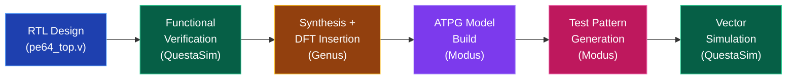
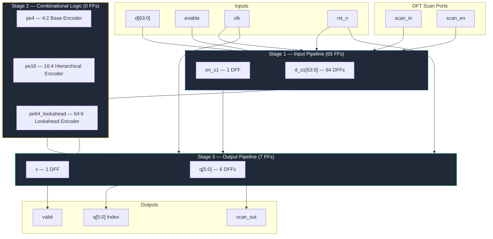

# Comprehensive DFT and ATPG Flow for Scalable 64:6 Priority Encoder with Pipelined I/O

This repository demonstrates a **complete DFT (Design for Testability) flow** on a custom-designed **64:6 Scalable Lookahead Priority Encoder with Pipelined Registered I/O** using Cadence tools (Genus, Modus) and Intel Quartus / QuestaSim. The flow involves synthesis, scan chain insertion, ATPG implementation, and functional verification.

Report: [ATPG_DFT_Fault_simulation_vikramaditya.pdf](docs/ATPG_DFT_Fault_simulation_vikramaditya.pdf)

---

## 1. Assignment Overview
| Step | Tool | Activity |
|------|------|----------|
| RTL Simulation | Quartus / QuestaSim | Functional verification of the Priority Encoder |
| Synthesis + DFT | Cadence Genus | Logic synthesis & scan chain insertion |
| ATPG Model Build | Cadence Modus | Build test model, verify scan structures |
| ATPG Generation | Cadence Modus | Generate test patterns & fault coverage |
| Vector Simulation | QuestaSim | Simulate ATPG vectors with PLI fault injection |


*Figure: The main DFT and ATPG workflow demonstrating the step-by-step pipeline from RTL design to Test Vector validation.*

---

## 2. Design Description: 64:6 Scalable Priority Encoder

The core design is a fully functioning **64:6 scalable lookahead priority encoder** spanning multiple pipeline stages with pipelined registered I/O for DFT scan chain demonstration.


*Figure: The RTL block diagram laying out the pipeline stages and encoder hierarchy.*

### Priority Encoder Hierarchy

The encoder uses a modular, tree-based decomposition for scalable priority resolution:

| Module | Function | Inputs → Outputs |
|--------|----------|-------------------|
| `pe4` | Base 4:2 priority encoder | `d[3:0]` → `q[1:0]`, `v` |
| `pe16` | Hierarchical 16:4 encoder (two-level pe4 tree) | `d[15:0]` → `q[3:0]`, `v` |
| `pe64_lookahead` | Lookahead 64:6 encoder (parallel OR-reduction) | `d[63:0]` → `q[5:0]`, `v` |
| `pe64_top` | Pipelined DFT wrapper (72 scan FFs) | `d[63:0]`, `enable` → `q[5:0]`, `v` |

### Scan Chain Mapping

| Bit Range | Register | Count | Pipeline Stage |
|-----------|----------|-------|----------------|
| 1 – 64 | `d_s1[63:0]` | 64 FFs | Input Stage |
| 65 | `en_s1` | 1 FF | Input Stage |
| 66 – 71 | `q[5:0]` | 6 FFs | Output Stage |
| 72 | `v` | 1 FF | Output Stage |
| **Total** | | **72 FFs** | **1 scan chain** |

---

## 3. Phase 1: Functional Verification (RTL Simulation)

Prior to any synthesis, functional RTL Verification simulates standard stimulus over our module to verify operations behave exactly as expected. We trace execution output validating zero flaws prior to scan insertion. PLI/C-code-based fault injection is used to verify stuck-at fault detectability at the RTL level.


*Figure: QuestaSim execution illustrating standard operation of priority encoder pipelining, multi-phase fault injection (Stuck-At-0 on block_valid, Stuck-At-1 on block_valid, Stuck-At-0 on row_index, Stuck-At-0 on block_index), and 100% fault coverage verification.*


*Figure: Intel Quartus synthesis structural properties showing the pe64_top module pinout and I/O configuration.*

### QuestaSim Fault Injection Results

| Metric | Value |
|--------|-------|
| Total Faults Injected | 4 |
| Total Faults Detected | 4 |
| **Fault Coverage** | **100.00%** |

---

## 4. Phase 2: Synthesis + DFT Insertion (Cadence Genus)

During this phase, Cadence Genus steps dynamically through our Verilog mapping out a generic gate-level architecture and resolving it into standard structural blocks mapped to the **90nm target library**. After successful generic and mapped synthesis, we introduce our DFT variables interconnecting scan flip-flops.


*Figure: Synthesized schematic of the priority encoder structure and its lookahead logic layout generated automatically via Cadence Genus GUI, showing 202 standard cells with scan chain routing.*

### DFT Synthesis Process

We explicitly set up `scan_en` and `clk_test`. The insertion replaces all 72 `DFFQXL`/`DFFTRXL` cells with muxed-scan `SDFFQXL`/`SDFFTRXL` equivalents. Each SDFF adds a 2:1 MUX on the D-input controlled by `scan_en`.

```mermaid
flowchart LR
    A["Read RTL\n(pe64_top.v)"] --> B["Elaborate\n& SDC"]
    B --> C["Generic\nSynthesis"]
    C --> D["Technology\nMapping (90nm)"]
    D --> E["DFT Rules\nCheck"]
    E --> F["replace_scan\n(72 FFs → SDFFs)"]
    F --> G["connect_scan_chains\n(chain1: 72 bits)"]
    G --> H["Post-DFT\nOptimization"]
    H --> I["Export Netlists\n& ATPG Files"]

    style A fill:#1E40AF,stroke:#60A5FA,color:#fff
    style F fill:#BE185D,stroke:#F472B6,color:#fff
    style G fill:#BE185D,stroke:#F472B6,color:#fff
    style I fill:#065F46,stroke:#34D399,color:#fff
```


*Figure: Process summary illustrating logic mapped synthesis transforming standard flip-flops into scan chains.*

### DFT Scan Chain Configuration

| Parameter | Value |
|-----------|-------|
| Scan Style | Muxed Scan |
| Scan Chains | 1 (`chain1`) |
| Chain Length | 72 bits |
| Shift Enable | `scan_en` (active high) |
| Test Clock | `clk_test` (rising edge, 10 ns) |
| Scan In | `scan_in` |
| Scan Out | `scan_out` |

### Pre vs Post DFT Area Report

| Metric | Pre-DFT | Post-DFT | Overhead |
|--------|---------|----------|----------|
| Cell Count | 202 | 202 | 0 |
| Cell Area (μm²) | 1912.686 | 2296.435 | +20.05% |
| Sequential Area (μm²) | 1257.968 (65.8%) | 1641.716 (71.5%) | +30.50% |
| Logic Area (μm²) | 645.636 (33.8%) | 645.636 (28.1%) | 0.00% |

### Pre vs Post DFT Power Report

| Category | Pre-DFT (μW) | Post-DFT (μW) | Change |
|----------|---------------|----------------|--------|
| Leakage | 9.60 | 12.17 | +26.8% |
| Internal | 120.16 | 126.56 | +5.3% |
| Switching | 17.30 | 19.10 | +10.4% |
| **Total** | **147.06** | **157.83** | **+7.3%** |

### Pre vs Post DFT Timing Report

| Parameter | Pre-DFT | Post-DFT |
|-----------|---------|----------|
| Critical Path Startpoint | `d_s1_reg[61]/CK` | `d_s1_reg[61]/CK` |
| Critical Path Endpoint | `q_reg[0]/D` | `q_reg[0]/D` |
| Data Path Delay (ps) | 3626 | 3625 |
| Setup Slack (ps) | 5876 | 5781 |
| Clock Period (ns) | 10 | 10 |
| **Timing** | **MET ✅** | **MET ✅** |

### Gate-Level Cell Composition (Post-DFT)

| Cell Type | Instances | Area (μm²) |
|-----------|-----------|-------------|
| SDFFQXL (Scan DFF) | 46 | 940.070 |
| SDFFQX1 (Scan DFF) | 1 | 20.436 |
| SDFFTRXL (Scan DFF w/ Reset) | 25 | 681.210 |
| NOR2BXL | 41 | 186.197 |
| AOI221XL | 9 | 68.121 |
| OR4XL | 8 | 54.497 |
| AOI22XL | 7 | 42.386 |
| AOI21XL | 7 | 31.790 |
| Other Logic | 58 | 272.728 |
| **Total** | **202** | **2296.435** |

---

## 5. Phase 3: ATPG and Fault Simulation (Cadence Modus)

Modus imports the generated scanned models initializing a rigid test structure matching hardware constraints with logical algorithmic paths discovering structural vulnerabilities (Stuck-At faults).


*Figure: Modus GUI structural visualization representing the pe64_top design hierarchy with scan chain routing, showing the FULLSCAN test mode with controllable and observable scan chains.*

### Modus Design Structural Summary

| Parameter | Value |
|-----------|-------|
| Design Top | `pe64_top` |
| Technology Library | 90nm (6 Verilog models) |
| Test Mode | FULLSCAN |
| Active Logic | 100.00% |
| Controllable Scan Chains | 1 |
| Observable Scan Chains | 1 |
| Total Scan Chain Length | 72 bit positions |

### ATPG Test Generation Results

Modus successfully generated optimal test patterns achieving near-perfect fault coverage:

| Test Iteration | Simulated | Effective | Faults Detected | Test Mode Coverage | Global Coverage | Untested Faults | Time |
|:-:|:-:|:-:|:-:|:-:|:-:|:-:|:-:|
| 1 | 1 | 1 | 511 | 25.50% | 25.50% | 1493 | 00:00.70 |
| 16 | 16 | 16 | 1262 | 88.47% | 88.47% | 231 | 00:00.74 |
| 32 | 32 | 32 | 91 | 93.01% | 93.01% | 140 | 00:00.75 |
| 48 | 48 | 48 | 63 | 96.16% | 96.16% | 77 | 00:00.75 |
| 64 | 64 | 64 | 54 | 98.85% | 98.85% | 23 | 00:00.76 |
| **78** | **78** | **78** | **23** | **99.99%** | **99.99%** | **0** | **00:00.76** |


*Figure: Modus ATPG coverage log output capturing complete test sequence coverage estimate report with per-sequence static, delta, and adjusted fault metrics across all 78 generated test patterns.*

### Scan Switching Analysis

| Parameter | Value |
|-----------|-------|
| Average Switching Percentage | 35.95% |
| Average Scan Load Switching | 11.66% |
| Average Scan Unload Switching | 24.28% |
| Max Switching Percentage | 65.27% |
| Average Capture Switching | 40.71% |
| Max Capture Switching | 65.27% |
| Tests Analyzed (Scan) | 79 |
| Tests Analyzed (Capture) | 78 |

> ⚠️ **Warning (TBM-099):** The switching percentage exceeded the threshold value of 30%, which may impact power numbers at the tester.


*Figure: Summarized switching statistics for SCAN and CAPTURE phases, memory usage summary, and complete message log including toggle analysis metrics.*

### Final ATPG Vector Output

| Parameter | Value |
|-----------|-------|
| Output Format | Verilog (Parallel) |
| Total Test Cycles | 148 |
| Test Cycles | 4 |
| Scan Cycles | 144 |
| Total Measures | 72 (all SO scan-out) |
| Odometer Range | 1.1.1.2.1 → 1.2.1.6.14 |
| Relative Test Numbers | 1 – 79 |

---

## 6. Final Results Summary

| Metric | Value |
|--------|-------|
| **Design** | pe64_top (64:6 Priority Encoder) |
| **Technology** | 90nm Slow Corner |
| **Total Scan FFs** | 72 (d_s1: 64 + en_s1: 1 + q: 6 + v: 1) |
| **Scan Chains** | 1 (chain1, muxed_scan) |
| **Genus Scan Coverage** | 100% (72/72 FFs replaced) |
| **Modus ATPG Coverage** | 99.99% (0 untested faults) |
| **QuestaSim Fault Coverage** | 100% (4/4 faults detected) |
| **Test Patterns Generated** | 78 parallel vectors |
| **Timing** | MET (5781 ps slack @ 100 MHz) |
| **Area Overhead (DFT)** | +20.05% |
| **Power Overhead (DFT)** | +7.3% |

---

## 7. Repository Structure
```
pe64_dft_project/
├── rtl/                          # RTL Source Files
│   └── pe64_top.v                # All modules: pe4, pe16, pe64_lookahead, pe64_top
├── tb/                           # Testbenches
│   └── pe64_top_tb.v             # Functional + fault injection testbench
├── constraints/                  # Timing Constraints
│   ├── pe64_top.sdc              # Input SDC for Genus
│   ├── pe64_top_pre_dft.sdc      # Pre-DFT generated SDC
│   └── pe64_top_post_dft.sdc     # Post-DFT generated SDC
├── scripts/                      # Tool Scripts
│   ├── run_genus_dft_pe64.tcl    # Genus: synthesis + scan insertion
│   └── runmodus.atpg.tcl         # Modus: fault modeling + ATPG
├── netlists/                     # Generated Netlists
│   ├── pe64_top_pre_dft.v        # Pre-DFT gate-level netlist
│   ├── pe64_top_post_dft.v       # Post-DFT gate-level netlist
│   ├── pe64_top.test_netlist.v   # Flattened ATPG netlist
│   ├── pe64_top_post_dft.sdf     # SDF back-annotation
│   ├── pe64_top.scandef          # Scan chain definition
│   └── pe64_top.FULLSCAN.*       # Pin assignment files
├── reports/                      # Tool Reports
│   ├── genus/                    # Genus synthesis reports
│   │   ├── pre_dft_*.rpt         # Pre-DFT area/power/timing/gates
│   │   ├── post_dft_*.rpt        # Post-DFT area/power/timing/gates
│   │   ├── scan_chains.rpt       # Scan chain mapping report
│   │   └── dft_setup.rpt         # DFT configuration report
│   └── modus/                    # Modus ATPG reports
│       ├── modus.log*            # ATPG execution logs
│       └── modus.cmd*            # ATPG command logs
├── images/                       # Screenshots & Figures
├── docs/                         # Documentation
│   └── ATPG_DFT_Fault_simulation_vikramaditya.pdf
└── README.md
```

---

## Getting Started
1. Set `GENUS_HOME`, `MODUS_HOME` in your environment.
2. Initialize base RTL paths: `xrun rtl/pe64_top.v tb/pe64_top_tb.v`
3. Execute Synthesis: `genus -f scripts/run_genus_dft_pe64.tcl`
4. Setup Test Patterns: `modus -f scripts/runmodus.atpg.tcl`
5. Simulate Vectors: `xrun netlists/pe64_top_post_dft.v tb/pe64_top_tb.v`

> **Note:** Modify execution scripts and `.pinassign` mappings if the targeted Foundry library (e.g., 90nm TSMC / digital paths) shifts. Standard configurations map directly against localized college execution environments.

---

**Author:** Vikramaditya  
**Department:** Department of Electronics and Communication Engineering  
**Indian Institute of Information Technology Design and Manufacturing Kurnool**
