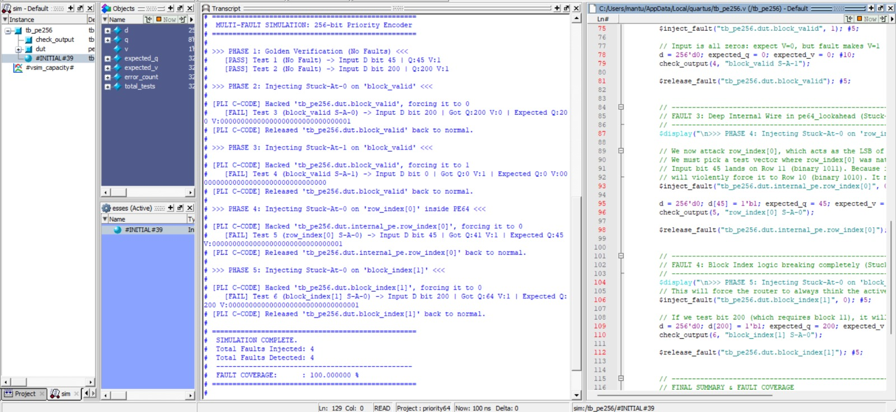
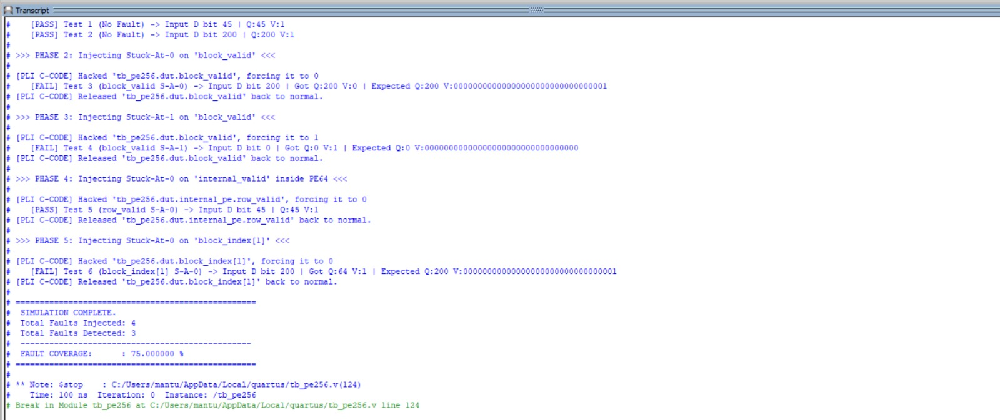
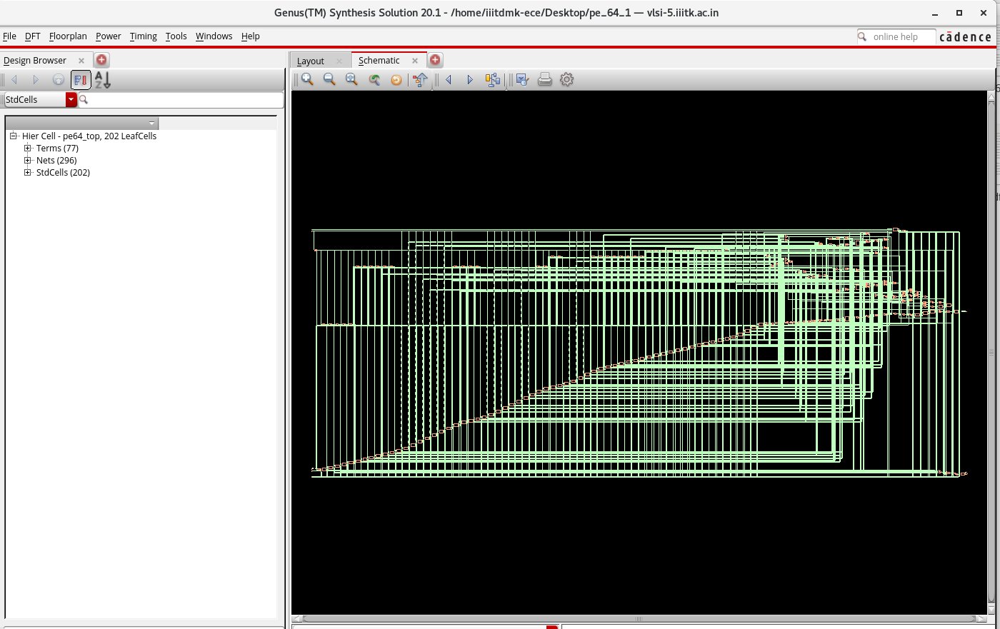
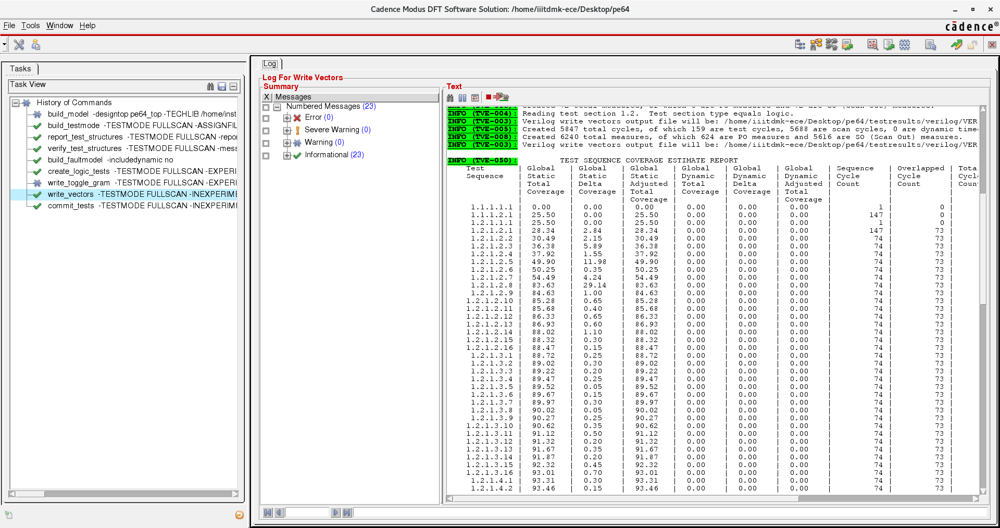
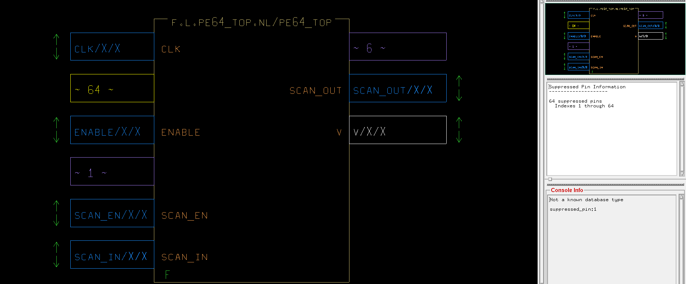

# Comprehensive DFT and ATPG Flow for 64:6 Scalable Priority Encoder

This repository demonstrates a **complete DFT (Design for Testability) flow** on a custom-designed **64:6 Scalable Lookahead Priority Encoder with Pipelined Registered I/O** using Cadence tools (Genus, Modus) and QuestaSim. The flow involves synthesis, scan chain insertion, ATPG implementation, and functional verification.

Report: [ATPG_DFT_Fault_simulation_vikramaditya.pdf](docs/ATPG_DFT_Fault_simulation_vikramaditya.pdf)

---

## 1. Assignment Overview
| Step | Tool | Activity |
|------|------|----------|
| RTL Simulation | Quartus / QuestaSim | Functional verification of the Priority Encoder |
| Synthesis + DFT | Cadence Genus | Logic synthesis & scan chain insertion |
| ATPG Model Build | Cadence Modus | Build test model, verify scan structures |
| ATPG Generation | Cadence Modus | Generate test patterns & fault coverage |

---

## 2. Design Description: 64:6 Priority Encoder
The core design is a fully functioning 64:6 scalable lookahead priority encoder.
- **Input Pipeline**: 64 D-Flip-Flops for data inputs `d[63:0]` and 1 for the `enable` signal.
- **Priority Logic**: A purely combinational 64:6 lookahead priority encoder hierarchy (utilizing 4:2 block instances).
- **Output Pipeline**: 6 D-Flip-Flops for the encoded output `q[5:0]` and 1 for the `valid` flag.
- **Total Scannable Elements**: 72 Flip-Flops.

---

## 3. Functional Verification (RTL Simulation)
Functional RTL Verification simulates standard stimulus over our module to verify operations behave exactly as expected. We trace execution output validating zero flaws prior to scan insertion.

*Figure: QuestaSim terminal and script execution illustrating standard operation of priority encoder pipelining, fault injection mapping, and continuous zero-flaw propagation.*

*Figure: Synthesis structural properties mapped inside Quartus interface.*

---

## 4. Synthesis + DFT Insertion (Cadence Genus)
During this phase, Cadence Genus steps dynamically through our Verilog mapping out a generic gate-level architecture and resolving it into standard structural blocks mapped to the 90nm target library. After successful generic and mapped synthesis, we introduce our DFT variables interconnecting scan flip-flops.

*Figure: Synthesized schematic of the priority encoder structure and its lookahead logic mapped out automatically via Cadence Genus GUI.*

### DFT Synthesis Results
We explicitly set up `scan_en` and `clk_test`. The insertion connects components into a defined serial topology creating a unified single scan chain (`chain1`).

---

## 5. Phase 3: ATPG and Fault Simulation (Cadence Modus)
Modus imports the generated scanned models initializing a rigid test structure matching hardware constraints with logical algorithmic paths discovering structural vulnerabilities (Stuck-At faults).

*Figure: Generation tracking iterations and Modus coverage log output, capturing complete arrays scaling logically unifiable vs detectable configurations.*

*Figure: Modus GUI structural visualization representing internal node nets bridging between input sequences.*

*Figure: Summarized switching statistics and detailed fault metrics breakdown against total potential generated vectors mapping out test sequence percentages.*

---

## 6. Repository Components
- `rtl/`: Contains the Verilog source `pe64_top.v` with hierarchical components.
- `tb/`: Functional testing verification testbench `pe64_top_tb.v`.
- `constraints/`: `.sdc` timing constraints tailored for 90nm slow operating conditions (100MHz target).
- `scripts/`: Tcl automation bindings `run_genus_dft_pe64.tcl` and `runmodus.atpg.tcl`.
- `netlists/`: Post-synthesis unflattened and flattened (test) structural netlists alongside SDF and SCANDEF files.
- `reports/`: Exported logs and analysis on Area, Power, Gates, and ATPG Fault Coverage from Genus/Modus.

---

## Getting Started
1. Set `GENUS_HOME`, `MODUS_HOME` in your localized environment.
2. Initialize base RTL functional verification paths.
3. Execute Synthesis: `genus -f scripts/run_genus_dft_pe64.tcl`
4. Setup Test Patterns: `modus -f scripts/runmodus.atpg.tcl`

---

**Author:** Vikramaditya
